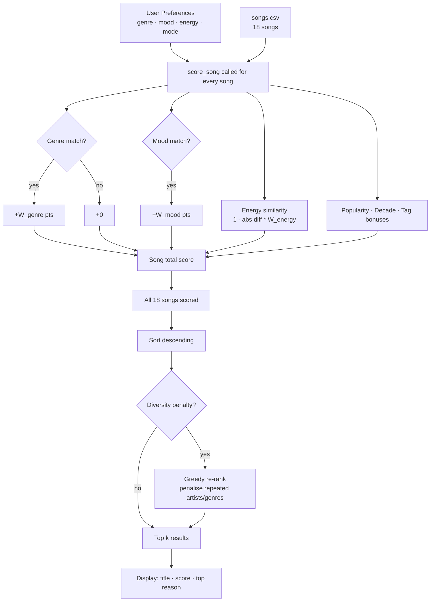

# Music Recommender Simulation

## Project Summary

This project simulates a content-based music recommendation system in Python. It reads a catalog of songs from a CSV file, compares each song's attributes against a user taste profile, assigns a weighted score, and returns the top-ranked suggestions with plain-language explanations. The goal is to demystify how real platforms like Spotify turn raw song data into personalized picks, and to surface the trade-offs and biases those systems inevitably carry.

---

## How The System Works

### Real-World Context: Two Approaches to Recommendation

Modern platforms use two main strategies:

- **Collaborative filtering** looks at what *other users* with similar taste enjoyed. If thousands of people who liked Song A also liked Song B, the system recommends Song B to you, without ever analyzing the music itself. Spotify's "Discover Weekly" relies heavily on this.
- **Content-based filtering** looks at the *attributes of the songs themselves* (genre, energy, tempo, mood) and finds songs that are mathematically similar to what you already like. It doesn't need other users at all.

VibeFinder uses **content-based filtering** because it works from day one with no listening history. The trade-off is that it can only surface songs similar to what the user explicitly told it they prefer; it never suggests genuinely surprising discoveries the way collaborative systems can.

### Why We Need Both a Scoring Rule and a Ranking Rule

- **Scoring Rule** answers: "How well does *this one song* match this user?" It produces a single number.
- **Ranking Rule** answers: "Given scores for *all songs*, which ones bubble to the top?" It sorts the full list and slices the top k.

You need both because scoring a song and choosing the best songs are logically separate steps. The scoring function is the "judge"; the ranking function is the "leaderboard."

### Song Features Used

| Feature | Type | Used in Scoring | Description |
|---|---|---|---|
| `genre` | string | Yes | Musical genre (pop, rock, lofi, …) |
| `mood` | string | Yes | Emotional tone (happy, chill, intense, …) |
| `energy` | float 0–1 | Yes | How driving or calm the track feels |
| `acousticness` | float 0–1 | Yes (bonus) | Acoustic vs. electronic character |
| `popularity` | int 0–100 | Yes | Mainstream appeal |
| `release_decade` | int | Yes (optional) | Era of the song (2010, 2020, …) |
| `mood_tags` | string | Yes | Detailed vibe tags (e.g., euphoric, nostalgic) |
| `tempo_bpm` | float | Loaded only | Beats per minute |
| `valence` | float 0–1 | Loaded only | Musical positivity |
| `danceability` | float 0–1 | Loaded only | Suited for dancing |

### User Profile

A `UserProfile` stores:

- `favorite_genre` / `favorite_mood` - preferred labels
- `target_energy` - ideal energy level (0.0-1.0)
- `likes_acoustic` - boolean bonus for acoustic songs
- `target_popularity` - preference for mainstream vs. underground (0-100)
- `preferred_decade` - era preference (0 = no preference)
- `favorite_mood_tags` - comma-separated vibe tags (e.g., `"euphoric,nostalgic"`)
- `scoring_mode` - selects a weight preset (`balanced`, `genre_first`, `mood_first`, `energy_focused`)

### Algorithm Recipe (Scoring Rule)

```
score = genre_match     (+W_genre  if genre == favorite_genre)
      + mood_match      (+W_mood   if mood == favorite_mood)
      + energy_sim      (W_energy  * (1.0 - |song_energy - target_energy|))
      + acoustic_bonus  (+W_acoustic  if likes_acoustic AND acousticness > 0.5)
      + pop_sim         (W_popularity * (1.0 - |song_pop - target_pop| / 100))
      + decade_bonus    (+W_decade if preferred_decade != 0 AND decade matches)
      + tag_match       (W_mood_tags * fraction_of_tags_matched)
```

### Scoring Mode Weights (Challenge 2)

| Weight key | balanced | genre_first | mood_first | energy_focused |
|---|---|---|---|---|
| genre | 2.0 | 4.0 | 1.0 | 0.5 |
| mood | 1.0 | 0.5 | 3.0 | 0.5 |
| energy | 1.0 | 0.3 | 0.5 | 3.0 |
| acoustic | 0.5 | 0.3 | 0.3 | 0.3 |
| popularity | 0.3 | 0.2 | 0.3 | 0.2 |
| decade | 0.2 | 0.1 | 0.1 | 0.1 |
| mood_tags | 0.5 | 0.3 | 1.0 | 0.3 |

### Ranking Rule

Once every song has a score, `recommend_songs` sorts the full list in descending order and returns the top `k` results as `(song, score, explanation)` tuples. An optional diversity penalty can then re-rank results to reduce artist/genre repetition.

### Data Flow (Mermaid Diagram)



---

## Getting Started

### Setup

1. Create a virtual environment (optional but recommended):

   ```bash
   python -m venv .venv
   source .venv/bin/activate      # Mac / Linux
   .venv\Scripts\activate         # Windows
   ```

2. Install dependencies:

   ```bash
   pip install -r requirements.txt
   ```

3. Run the recommender:

   ```bash
   python -m src.main
   ```

### Running Tests

```bash
pytest
```

---

## Terminal Output

```
Loaded 18 songs.

Available scoring modes: balanced, genre_first, mood_first, energy_focused

==============================================================
  High-Energy Pop
==============================================================
  #  Title           Genre        Score  Top Reason
---  --------------  ---------  -------  ------------------------
  1  Sunrise City    pop           4.26  genre match (pop, +2.0)
  2  Gym Hero        pop           3.21  genre match (pop, +2.0)
  3  Neon Blossom    k-pop         2.27  mood match (happy, +1.0)
  4  Rooftop Lights  indie pop     2.17  mood match (happy, +1.0)
  5  Golden Hour     r&b           2.15  mood match (happy, +1.0)

==============================================================
  Chill Lofi
==============================================================
  #  Title               Genre      Score  Top Reason
---  ------------------  -------  -------  ------------------------
  1  Library Rain        lofi        5.18  genre match (lofi, +1.0)
  2  Midnight Coding     lofi        5.17  genre match (lofi, +1.0)
  3  Spacewalk Thoughts  ambient     4.1   mood match (chill, +3.0)
  4  Island Groove       reggae      4.01  mood match (chill, +3.0)
  5  Focus Flow          lofi        2.18  genre match (lofi, +1.0)

==============================================================
  Deep Intense Rock
==============================================================
  #  Title         Genre         Score  Top Reason
---  ------------  ----------  -------  ---------------------------
  1  Storm Runner  rock           4.98  genre match (rock, +4.0)
  2  Iron Curtain  metal          0.98  mood match (intense, +0.5)
  3  Circuit Rush  electronic     0.96  mood match (intense, +0.5)
  4  Gym Hero      pop            0.96  mood match (intense, +0.5)
  5  Block Party   hip-hop        0.45  energy similarity (+0.28)

==============================================================
  Conflicting: High Energy + Chill Mood
==============================================================
  #  Title         Genre         Score  Top Reason
---  ------------  ----------  -------  -------------------------------
  1  Storm Runner  rock           3.13  energy similarity (0.99, +2.97)
  2  Block Party   hip-hop        3.05  energy similarity (0.97, +2.91)
  3  Gym Hero      pop            3.04  energy similarity (0.97, +2.91)
  4  Circuit Rush  electronic     2.99  energy similarity (0.95, +2.85)
  5  Iron Curtain  metal          2.97  energy similarity (0.93, +2.79)

==============================================================
  Niche Folk Listener
==============================================================
  #  Title                Genre      Score  Top Reason
---  -------------------  -------  -------  ---------------------------
  1  Desert Wind          folk        5.19  genre match (folk, +1.0)
  2  Coffee Shop Stories  jazz        4.14  mood match (relaxed, +3.0)
  3  Rainy Porch          country     4.12  mood match (relaxed, +3.0)
  4  Spacewalk Thoughts   ambient     1.06  energy similarity (+0.48)
  5  Island Groove        reggae      1.03  energy similarity (+0.39)

==============================================================
  Weight Experiment A - Balanced (genre w=2.0, energy w=1.0)
==============================================================
  #  Title           Genre        Score  Top Reason
---  --------------  ---------  -------  ------------------------
  1  Sunrise City    pop           4.20  genre match (pop, +2.0)
  2  Gym Hero        pop           3.06  genre match (pop, +2.0)
  3  Rooftop Lights  indie pop     2.21  mood match (happy, +1.0)
  4  Golden Hour     r&b           2.15  mood match (happy, +1.0)
  5  Neon Blossom    k-pop         2.15  mood match (happy, +1.0)

==============================================================
  Weight Experiment B - Energy-Focused (energy w=3.0, genre w=0.5)
==============================================================
  #  Title           Genre        Score  Top Reason
---  --------------  ---------  -------  ------------------------
  1  Sunrise City    pop           4.08  genre match (pop, +0.5)
  2  Rooftop Lights  indie pop     3.54  mood match (happy, +0.5)
  3  Neon Blossom    k-pop         3.50  mood match (happy, +0.5)
  4  Golden Hour     r&b           3.41  mood match (happy, +0.5)
  5  Gym Hero        pop           3.24  genre match (pop, +0.5)
```

---

## Experiments You Tried

| Change | Observation |
|---|---|
| Default pop/happy/0.8 (balanced) | Sunrise City and Gym Hero dominate because genre +2.0 is the largest single bonus available |
| Switch to "energy_focused" mode | Gym Hero drops from #2 to #5 for the same pop/happy/0.8 user; Rooftop Lights (indie pop) rises to #2 because its energy 0.76 is closer than Gym Hero's 0.93 |
| "Conflicting" profile (ambient + chill mood + energy 0.9) | Energy completely wins; the top 5 are all high-energy tracks from different genres, none are ambient or chill. The system cannot reconcile contradictory signals |
| Niche folk user | Only one folk song exists (Desert Wind). After that the system falls back to mood matches across jazz, country, ambient; the results are reasonable but the catalog hole is obvious |
| Diversity penalty 0.5 | Gym Hero's displayed score drops from 3.21 to 2.96 (pop genre already seen). With only 18 songs the top-5 list stays the same but scores shift |
| Mood-Tag Hunter (nostalgic + euphoric) | Rooftop Lights jumps past Golden Hour because it carries both a "nostalgic" tag match and a "bright" tag partial match; Golden Hour has "warm,uplifting" which overlap less |

---

## Limitations and Risks

- **Tiny catalog** - 18 songs is too small to surface genuinely surprising picks.
- **Exact string matching** - "indie pop" and "pop" score 0 genre overlap.
- **Filter bubble risk** - genre's high weight means the list is almost always one genre deep.
- **No listening history** - the system treats every session identically.
- **Contradictory profiles** - when energy and mood point in opposite directions, whichever has the higher weight in the chosen mode silently wins with no warning to the user.
- **Western bias** - no classical, Afrobeats, Bollywood, or Latin genres in the catalog.

---

## Reflection

See [model_card.md](model_card.md) for the full model card and personal reflection.

Building this system made the "magic" of Spotify feel surprisingly mechanical. What's striking is how much a simple rule *mostly works* for obvious profiles while completely failing at the edges. The weight-shift experiment was the clearest demonstration: just changing the energy weight from 1.0 to 3.0 pushed Gym Hero from #2 to #5 for the same user preferences. One number, quietly shaping every recommendation.

The adversarial "conflicting" profile was the most revealing test. A user who wants chill mood but high energy gets five intense rock and hip-hop tracks; zero ambient, zero chill. The system has no way to negotiate between conflicting signals; it just adds up the numbers and the loudest wins.
